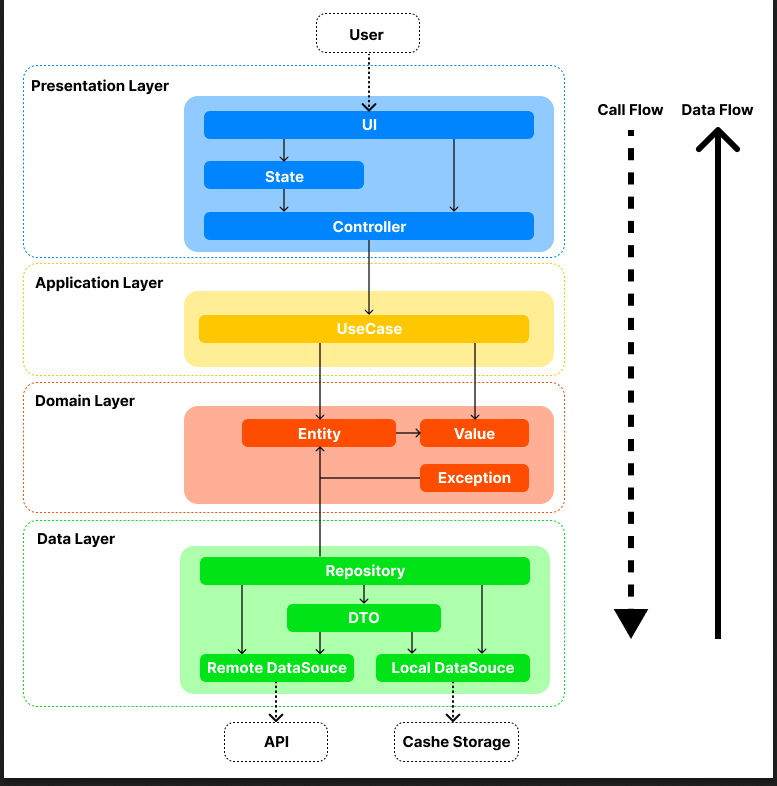
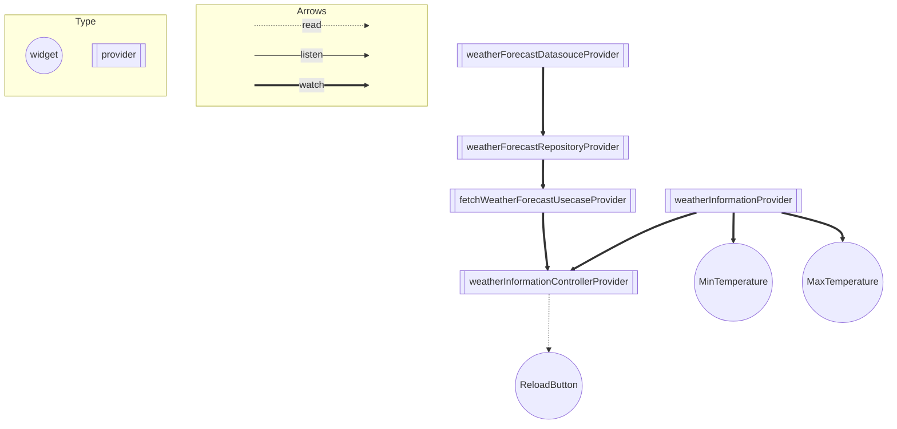

# ARCHITECTURE.md
## はじめに
 レイヤードアーキテクチャをモデルに、状態管理パッケージ「Riverpod」を使用しアーキテクチャを作成している.

## アーキテクチャ

### Presentation
 `Presentation`層は UIを管理しつつユーザーからのイベント処理を受け付け、ウィジェットを用いて画面の構築を担当する.
* UI
 各スクリーンやウィジェットなどユーザーに定義する.
* State
  `UI`の状態を管理し、必要に応じてリアクティブな動作を実現する.
* Controller
 ユーザーからの入力やアクションを受け付け、それに基づいて`UseCase`の呼び出しや画面の制御を担当する. 

### Application
 `Application`層は具体的なビジネスロジックやユースケースを実装する.
* Usecase
 具体的なタスクや操作を実現するためのビジネスロジックを定義する. `Controller`から呼ばれ、`Domain`層の`Entity`や`Value`を使用する.

### Domain
 `Domain`層は抽象化やバリデーター、およびエンティティを定義しビジネスオブジェクトを表現する. そして、`Domain`層はどの層にも依存しない.
* Entity
 アプリケーションの中での重要な概念やデータを表すオブジェクト. また、バリデーターやデータの変更や操作に関連するビジネスルールを定義する.
* Value
 `Entity`ほどビジネスロジックに関係しないオブジェクトを定義する.（アプリ内でのみ使用するenumなど）
* Exception
 `DataSource`で発生する可能性のある例外を定義する.

### Data
 `Data`層はアプリケーションの最も外側の層に位置し、リモートサーバーまたはローカルキャッシュとの通信を担当する.
* Repository
 `Data`層と`Domain`層の間のブリッジ. `Repository`は、さまざまなデータソースからのデータを調整する.
* DTO
 `DataSouce`へデータの格納・読み出しのためエンティティからJSONに変更する、もしくはJSONから`Domain`層が理解できる`Entity`に変換するためのメソッドやデータクラスを定義したオブジェクト.
* DataSource
 `RemoteDataSource`と`LocalDataSource`で構成されます.`RemoteDataSource`はAPIを実行します.`LocalDataSource`はデータをキャッシュまたは永続化します.また、使用するAPIの変更やプラットフォームによってAPIを選択する際などのケースを想定し、`Domain`層で定義したインターフェースの実装する.

## RiverpodとProviderの依存関係図
